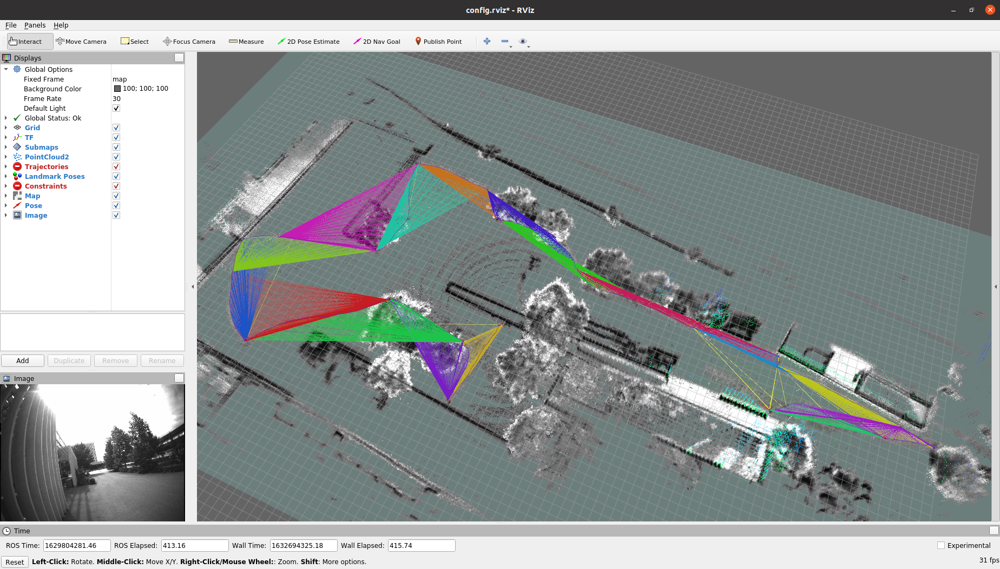

### General usage guidelines

(you can figure out the rest)

```
 cd docker 
 ./build.bash
 ./run.bash
```

Within the container, to run one of the datasets:

```
 catkin_make
 source devel/setup.bash
 roslaunch tij_challenger process_dataset_00_uzh_tracking_area_run_2.launch
```

The launch files assume that the Hilti Challenge 2021 dataset are located witin `dataset/` with the following structure:

```
dataset_00_uzh_tracking_area_run_2/
dataset_01_campus_2/
dataset_02_Basement_1/
dataset_03_Basement_3/
dataset_04_Basement_4/
dataset_05_Construction_Site_1/
dataset_06_IC_Office_1/
dataset_07_Lab_Survey_2/
dataset_08_Office_Mitte_1/
dataset_09_Parking_1/
dataset_10_Construction_Site_2/
dataset_11_campus_1/
```

### Keep in mind that

* The bagfiles must be located within the right folder with their original names.
* The ground truth data must be have been renamed `stamped_groundtruth.txt` (this is a requirement due to the package `rpg_trajectory_evaluation` used to evaluate).
* **The rosbags need to have been previously decompressed!**
* There's a utility script within `datasets/` to generate the graphics to evaluate all the datasets (the estimation data needs to have been generated previously).

